# InkCat — SMOC: A Modular, Self-Calibrating SCARA Robot

**A 5-DOF desktop SCARA manipulator built around a distributed embedded control network, continuous self-calibrating sensor fusion, and a simulation-first (Unity3D/ROS2) development pipeline.**

InkCat is a proof-of-concept precision robotic arm — not a hobby kit adaptation. Every layer of the stack was designed from scratch: the SolidWorks CAD kinematic chain, two custom PCB families (a supervisory controller and a distributed per-joint actuator board), a MATLAB/Simulink closed-loop control architecture validated against a Simscape Multibody model, and a Unity3D + ROS2 + OpenCV vision pipeline for perception-guided pick-and-place.

The long-term goal is ambitious by design: take this arm from a 3D-printed, PLA-bodied proof of concept to a rigid, millimeter-precision manipulator capable of tasks like PCB-grade component placement and even in-house PCB fabrication steps — the kind of precision work usually reserved for industrial SCARA arms costing orders of magnitude more.

<p align="center">
  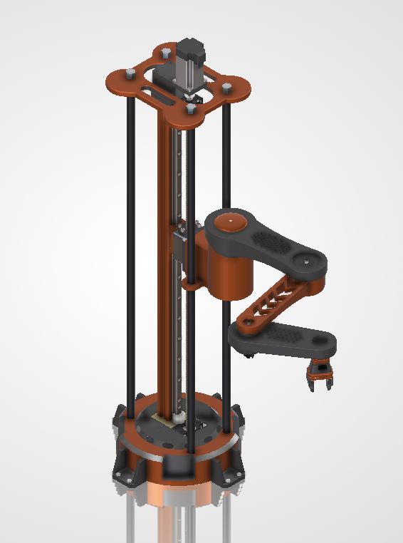
</p>

---

## Table of Contents

- [Project Status](#project-status)
- [Why This Project Is Different](#why-this-project-is-different)
- [Tech Stack](#tech-stack)
- [System Architecture](#system-architecture)
- [Mechanical Design & CAD](#mechanical-design--cad)
  - [Kinematic Configuration](#kinematic-configuration)
  - [Structural Design](#structural-design)
  - [Material Strategy — Prototype vs. Deployment](#material-strategy--prototype-vs-deployment)
- [Electronics — Distributed Control Architecture](#electronics--distributed-control-architecture)
  - [Vesper ONE — Main Supervisory Controller](#vesper-one--main-supervisory-controller)
  - [FluxCruiser — Per-Joint Actuator Node](#fluxcruiser--per-joint-actuator-node)
  - [Sensor Fusion & Self-Calibration](#sensor-fusion--self-calibration)
- [Control Loop — MATLAB/Simulink Architecture](#control-loop--matlabsimulink-architecture)
- [Software & Perception Stack](#software--perception-stack)
- [Power Architecture](#power-architecture)
- [Repository Structure](#repository-structure)
- [How to Replicate / Build On This Project](#how-to-replicate--build-on-this-project)
- [Known Limitations](#known-limitations)
- [Roadmap](#roadmap)
- [Reference Material](#reference-material)
- [Credits](#credits)

---

## Project Status

This repository currently documents a **validated proof of concept**: the CAD kinematic design is complete and rendered, the control loop is validated in MATLAB/Simulink against a Simscape Multibody model, and both PCBs (Vesper ONE and FluxCruiser) are schematic-complete CAD designs. Firmware, ROS 2 nodes, and ML/vision scripts are **actively in development** and will be added to [`firmware/`](firmware/) as they're built and tested — see the disclaimers in each firmware subfolder for current status.

| Layer | Status |
|---|---|
| Mechanical CAD (SolidWorks) | ✅ Complete — full assembly modeled, rendered, exportable (STL/GLB/STEP) |
| Control loop (MATLAB/Simulink) | ✅ Validated in simulation (Simscape Multibody + EKF) |
| PCB schematics (Vesper ONE, FluxCruiser) | ✅ Schematic-complete, pre-fabrication |
| STM32 firmware | 🚧 In development — see [`firmware/stm32/`](firmware/stm32/) |
| ROS 2 / perception nodes | 🚧 In development — see [`firmware/ros2/`](firmware/ros2/) |
| ML / vision scripts | 🚧 In development — see [`firmware/ml_models/`](firmware/ml_models/) |
| Physical fabrication & assembly | 🔜 Planned next phase |

---

## Why This Project Is Different

- **Distributed embedded architecture, not a single MCU.** Rather than one microcontroller trying to run kinematics, sensor fusion, and motor control simultaneously, InkCat splits the workload: a supervisory STM32H743 (Vesper) handles the computationally heavy state estimation and trajectory planning, while three independent STM32G431 actuator nodes (FluxCruiser) run deterministic, low-latency Field-Oriented Control locally — a pattern borrowed from how modern industrial robot controllers are actually built.
- **Continuous self-calibration, not open-loop trust.** Four independent sensing sources (joint encoders, an optical base-offset sensor, a magnetic Z-height encoder, and per-node IMUs) are fused in a recursive state estimator so the robot's internal model of itself stays accurate under drift, wheel slip, or mechanical offset — without a manual recalibration step between runs.
- **Simulation-first development.** The full control loop was validated in MATLAB/Simulink against a Simscape Multibody model — including Computed Torque Control derived from the Euler-Lagrange formulation — before any hardware commitment. A parallel Unity3D + ROS2 digital twin lets the vision and perception pipeline be tested against simulated sensor noise and lighting variation before ever touching a real camera.
- **Two custom PCB families, designed for the specific problem.** Vesper ONE centralizes every non-actuator sensor and external communication interface (Ethernet, USB-C, CAN-FD) so no other board in the system needs an external connection. FluxCruiser offloads FOC math to a dedicated Trinamic TMC9660 gate driver per joint, keeping actuator nodes lightweight and deterministic.
- **A deliberately staged material strategy.** The mechanical design is built so the same CAD platform can go from an FDM-printed PLA prototype (for validating kinematics and control) to a CNC-machined aluminum/steel deployment unit — without a structural redesign in between.
- **An explicit path to industrial-grade precision.** The stated end goal — millimeter-precision pick-and-place, PCB-grade component handling, and eventually PCB manufacturing steps — is treated as a real design constraint from day one, not an afterthought bolted on once the arm can already move.

---

## Tech Stack

| Layer | Choice |
|---|---|
| Mechanical CAD | SolidWorks 2026 |
| Supervisory Controller | STM32H743ZIT6 (Arm Cortex-M7, up to 480 MHz) — "Vesper ONE" |
| Actuator Node MCU (×3) | STM32G431 — "FluxCruiser" |
| Motor Driver / FOC Engine | Trinamic TMC9660 (×3, one per joint) |
| Z-Axis Stepper Driver | Trinamic TMC5160 (on Vesper) |
| Joint Encoders | SIKO MSC500 absolute magnetic encoder (×3) |
| Base Offset Sensor | PixArt PMW3389 high-precision optical motion sensor |
| IMUs | ADI ADIS16470-class / ICM-45686 6-axis (per actuator node) |
| Communication | CAN-FD (MAX33012EASA+), Ethernet (ADIN1200 PHY), USB Type-C, SPI, UART, I²C |
| Control Design | MATLAB/Simulink 2025, Simscape Multibody, Extended Kalman Filter |
| Control Law | Computed Torque Control (Euler-Lagrange), PD feedback, quintic polynomial trajectory planning, ADRC (planned for embedded target) |
| Simulation / Digital Twin | Unity3D + ROS 2 |
| Computer Vision | OpenCV (HSV segmentation, monocular projection) |
| PCB Design | KiCad / Altium Designer 2025 |
| Motor / Magnetics Design | Ansys Maxwell |
| Prototype Material | PLA (FDM) / Carbon-Fiber-Reinforced PLA |
| Deployment Material | Aluminium 6061-T6 (links, column), steel (base, joint shafts, fasteners) |

---

## System Architecture

```
                         ┌─────────────────────────────────────────┐
                         │      VESPER ONE (STM32H743ZIT6)         │
   Vision (Ethernet/USB) │      Supervisory Controller             │
   ─────────────────────►│  • Sensor fusion (EKF/EWMA)             │
                         │  • Self-calibration engine              │
   PMW3389 (base offset) │  • Inverse kinematics                   │
   ─────────────────────►│  • Quintic trajectory planning          │
                         │  • ADRC / high-level closed-loop control│
   MSC500 (Z-height)     │  • TMC5160 — Z-axis stepper drive       │
   ─────────────────────►│                                         │
                         └───────────────┬─────────────────────────┘
                                         │ CAN-FD
                ┌────────────────────────┼────────────────────────┐
                ▼                        ▼                        ▼
    ┌─────────────────────┐    ┌────────────────────┐    ┌────────────────────┐
    │  FluxCruiser #1     │    │  FluxCruiser #2    │    │  FluxCruiser #3    │
    │  (Shoulder)         │    │  (Elbow)           │    │  (Wrist)           │
    │  STM32G431 + TMC9660│    │ STM32G431 + TMC9660│    │ STM32G431 + TMC9660│
    │  + IMU + Encoder    │    │ + IMU + Encoder    │    │ + IMU + Encoder    │
    └─────────┬───────────┘    └─────────┬──────────┘    └─────────┬──────────┘
              ▼                          ▼                         ▼
         BLDC Motor                BLDC Motor              BLDC Motor / Gripper
         (Shoulder)                 (Elbow)                  (Wrist + Gripper)
```

Vesper is the single point of contact for every non-actuator sensor and all external communication — no other board in the system carries a direct external connection. The three FluxCruiser nodes handle only their local joint's current/velocity/position loop and stream raw encoder/IMU data back to Vesper over CAN-FD as ground-truth feedback, independent of what was actually commanded.

---

## Mechanical Design & CAD

<p align="center">
  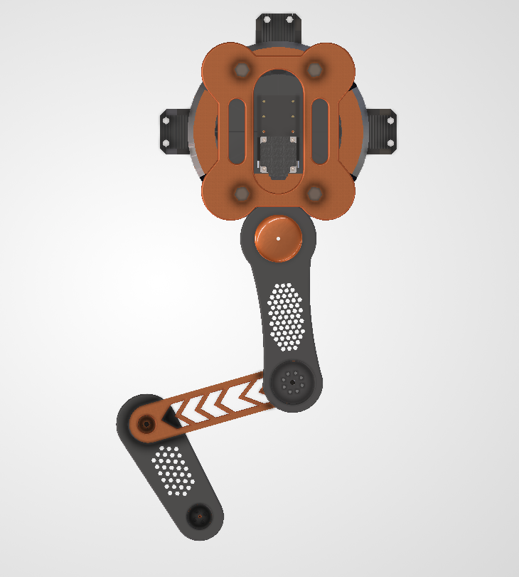
  &nbsp;&nbsp;
  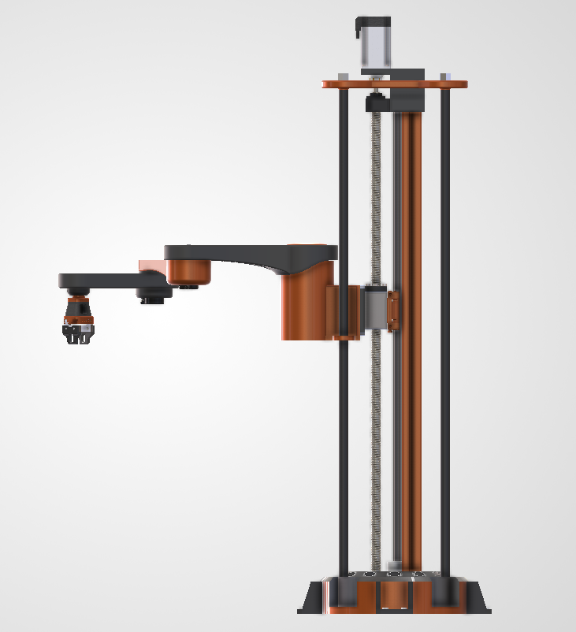
</p>

### Kinematic Configuration

InkCat is a custom 5-degree-of-freedom desktop SCARA following a **Prismatic–Revolute–Revolute–Revolute–Prismatic (P-R-R-R-P)** joint chain. This is the classic SCARA layout — high stiffness along the vertical Z-axis, selective compliance in the horizontal X-Y plane — extended with a wrist revolute joint and a rack-and-pinion parallel-jaw gripper for full end-effector orientation and controlled grasp force.

| Joint | Type | Actuation | Primary Function |
|---|---|---|---|
| DOF 1 — Z Axis | Prismatic | Lead-screw linear actuator + linear guide rail | Vertical approach, pickup, placement, height adjust |
| DOF 2 — Shoulder | Revolute | BLDC motor, vertical axis | Primary arm sweep, workspace coverage |
| DOF 3 — Elbow | Revolute | BLDC motor, vertical axis | Reach extension, fine positioning |
| DOF 4 — Wrist | Revolute | BLDC motor, vertical axis | End-effector orientation, placement alignment |
| DOF 5 — Gripper | Prismatic | Rack-and-pinion, parallel jaws | Grasp, release, precision manipulation |

The resulting workspace is cylindrical: vertical reach is set by the Z-axis stroke, and horizontal reach by the two-link arm's combined length — giving the arm the SCARA-defining trait of being naturally forgiving for vertical insertion tasks (PCB/connector-style assembly) while remaining precisely positioned laterally.

### Structural Design

<table>
  <tr>
    <td width="260" align="center">
      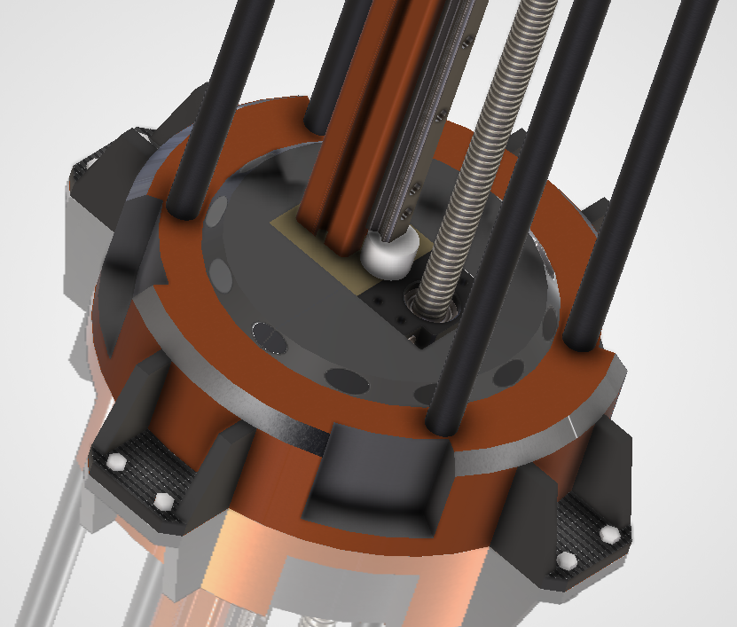<br>
      <sub><b>Base & Z-column</b></sub>
    </td>
    <td>The base is an enclosed housing with a removable cover, internally compartmentalized for the PCB, motor drivers, wiring harnesses, and power electronics. Keeping all electronics inside the base lowers the overall center of gravity and keeps the arm's kinematic assembly above it undisturbed during maintenance. The vertical column integrates the linear guide rail, lead screw, drive motor enclosure, and sliding carriage into one rigid structural member — it has to carry axial load and resist the bending moment of the fully extended arm simultaneously, which drove the choice of a ribbed, large-cross-section profile.</td>
  </tr>
  <tr>
    <td width="260" align="center">
      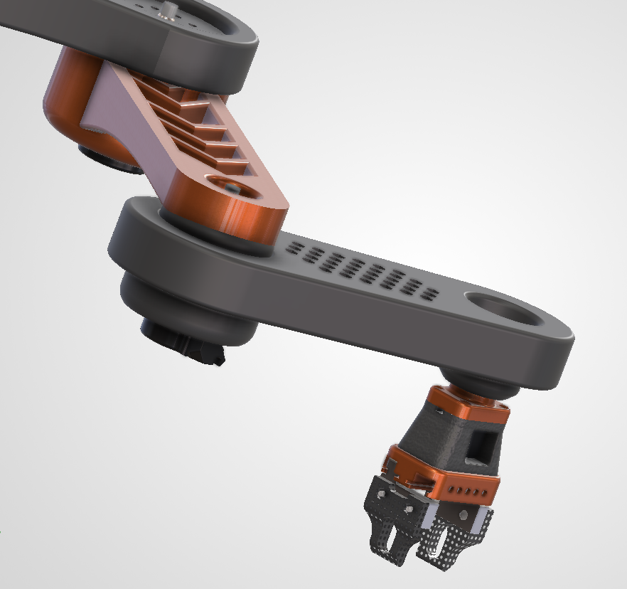<br>
      <sub><b>Upper arm & fore-arm links</b></sub>
    </td>
    <td>Both arm links use a hollow, ribbed shell geometry with rounded edges and a deliberately large bending depth. This is a weight-optimization strategy — removing material from the neutral bending axis while retaining depth preserves stiffness-to-weight ratio, which directly reduces the rotational inertia the shoulder and elbow BLDC motors have to overcome during acceleration.</td>
  </tr>
  <tr>
    <td width="260" align="center">
      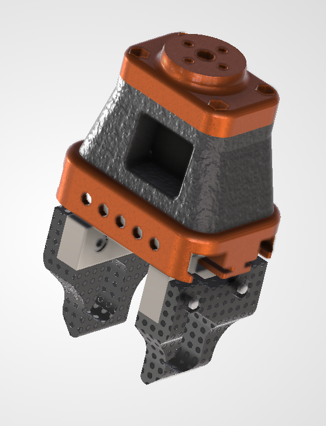<br>
      <sub><b>Wrist & gripper</b></sub>
    </td>
    <td>The wrist is a compact rotational stage that orients the gripper before grasp. The end effector is a parallel-jaw gripper actuated through a rack-and-pinion mechanism, chosen for symmetric jaw travel, positive mechanical engagement, and repeatable grip force — suited to PCB handling, small mechanical parts, and lab-sample manipulation.</td>
  </tr>
  <tr>
    <td width="260" align="center">
      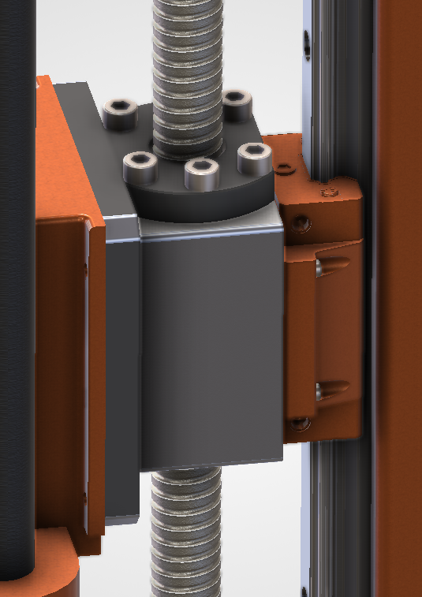<br>
      <sub><b>Z-axis actuator detail</b></sub>
    </td>
    <td>Close-up of the lead-screw carriage and linear guide interface — the load path the entire arm hangs off of. Precision here directly bounds the vertical repeatability of the whole manipulator.</td>
  </tr>
</table>

**Design language:** the platform deliberately follows a hidden-actuator, minimal-fastener visual language — motor housings enclosed, fillets consistent across every structural part, symmetric arm proportions, and an orange-and-black color scheme meant to read as a finished product rather than a lab rig.

**Manufacturability:** the CAD is built as a serviceable modular assembly — independently swappable link components, fully enclosed electronics, and internal cable routing through the column and links — suited to FDM/SLA printing of the structural shells combined with off-the-shelf linear guides, lead screws, bearings, and fasteners for the motion-critical interfaces.

### Material Strategy — Prototype vs. Deployment

| Phase | Structural Components | Motion / Hardware Components |
|---|---|---|
| **Phase 1 — Prototype / Testing** | PLA (FDM 3D-printed): base shell, links, wrist housing, gripper jaws | Steel lead screw & linear rail, standard bearings, off-the-shelf BLDC motors and fasteners |
| **Phase 2 — Final Deployment** | Aluminium 6061-T6 (links & column, machined/CNC); steel (high-load base and joint interfaces) | Precision-ground steel lead screw, hardened linear rails, rubber gripper-jaw inserts, sealed bearings |

PLA is used for the initial prototype because of its dimensional stability, ease of printing, low cost, and adequate stiffness for validating kinematics and control-loop tracking without committing to expensive tooling. Deployment shifts structural links and the column to machined aluminum 6061-T6 for strength-to-weight and corrosion resistance, while high-load interfaces move to steel for durability under repeated cyclic loading. Rubber inserts at the gripper jaw contact faces increase grip friction and give compliant, damage-safe handling of delicate PCB and electronic payloads.

| Parameter | Value |
|---|---|
| Overall footprint (base ⌀) | 300 ± 5 mm |
| Total height (Z fully retracted) | 100 ± 5 mm |
| Maximum horizontal reach | 505 ± 5 mm |
| Maximum payload (PLA prototype build) | 1.25 ± 0.05 kg |
| Maximum payload (aluminum deployment build) | 11.50 ± 0.25 kg |

*(Dimensional figures above are the CAD-derived design targets from the current proof-of-concept model.)*

---

## Electronics — Distributed Control Architecture

### Vesper ONE — Main Supervisory Controller

<p align="center">
  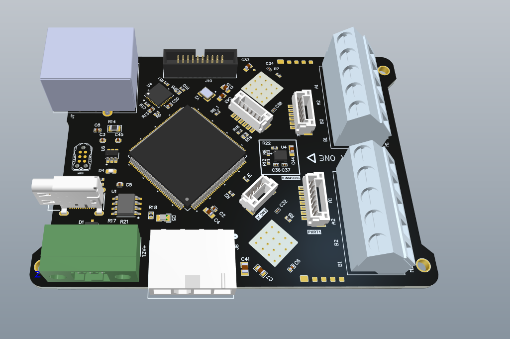
</p>

Vesper ONE is the single supervisory board in the system — every non-actuator sensor terminates here, and no other board carries a direct external connection. It's built around an **STM32H743ZIT6**, whose Arm Cortex-M7 core runs up to 480 MHz with a double-precision FPU and hardware Chrom-ART acceleration, backed by up to 2 MB flash / 1 MB SRAM — enough headroom to run sensor fusion, inverse kinematics, and trajectory generation without offloading that work to the actuator nodes.

Alongside the H743, Vesper integrates a **Trinamic TMC5160** stepper driver for the Z-axis lead-screw motor. Its StealthChop2 voltage-mode chopper keeps the vertical axis quiet and low-vibration, 256-step MicroPlyer interpolation smooths motion from coarse step inputs, and integrated stallGuard4 sensorless load detection allows automatic end-of-travel detection — meaning Z-axis recalibration doesn't need physical limit switches.

External communication runs through an **ADIN1200** Ethernet PHY (vision data) and a **MAX33012EASA+** CAN-FD transceiver (actuator/encoder/IMU traffic), plus USB Type-C, SPI, UART, and I²C.

<p align="center">
  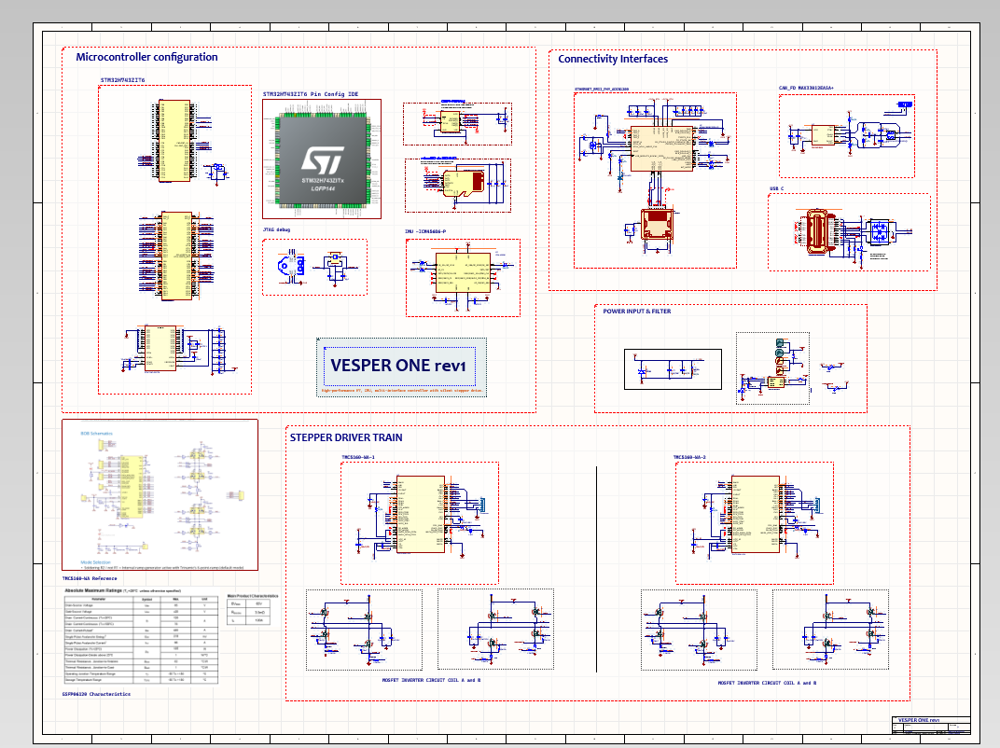
</p>

<p align="center"><sub>Vesper ONE schematic — microcontroller configuration, connectivity interfaces (Ethernet/CAN-FD/USB-C), power input & filtering, and the dual-TMC5160 stepper driver train.</sub></p>

### FluxCruiser — Per-Joint Actuator Node

<p align="center">
  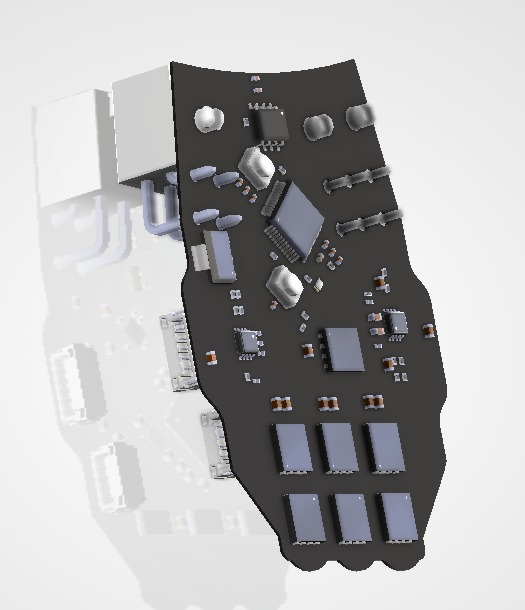
  &nbsp;&nbsp;
  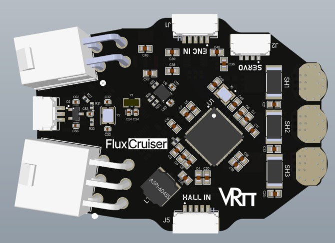
</p>

FluxCruiser is the distributed motor-control PCB deployed at each of the arm's three kinematic joints (shoulder, elbow, wrist), offloading Field-Oriented Control math to a dedicated gate driver for deterministic, low-latency motion control local to the joint.

**Core processing:** an **STM32G431** manages kinematic trajectories, CAN-FD communication, and sensor data, while a **Trinamic TMC9660** handles FOC phase mathematics and motor timing — the two linked via a high-speed SPI bus.

**Power:** motor power arrives via a 48V Molex connector rated to 27A, with an isolated 12V flyback rail for logic and gate drivers. An AMS1117-3.3 LDO supplies the STM32G431's 3.3V rail; the TMC9660's internal LDO generates an auxiliary 5V rail for sensors.

**Power stage & safety:** the 3-phase inverter uses over-specced Goodark 100V/80A MOSFETs for thermal headroom against inductive spikes, and a hardware brake chopper dumps regenerative energy into a shunt resistor to protect the 48V bus from overvoltage during sharp decelerations.

**Sensing & telemetry:** each node carries an onboard **ICM-45686** 6-axis IMU for gravitational compensation and vibration damping, plus JST-GH interfaces for Hall-effect sensors and encoders, linking back to Vesper via CAN-FD.

### Sensor Fusion & Self-Calibration

The core technical contribution of this project is a **continuous self-calibration layer** that keeps the robot's internal state accurate under drift, wheel slip, and mechanical offset — without a manual recalibration step between runs. Four independent sensing sources feed a recursive state estimator running on Vesper's STM32H743:

- **Joint & actuator encoders (all three nodes)** — each TMC9660 is direct-coupled to its local encoder for closed-loop current/velocity/position control; raw counts also stream to Vesper as ground-truth joint feedback, independent of what was commanded.
- **PMW3389 optical motion sensor — base offset** — functions like a high-speed optical mouse sensor, imaging the surface beneath the base and cross-correlating successive frames to compute incremental X-Y displacement, accumulating any planar offset or rotation caused by wheel slip or a mechanical bump.
- **MSC500 magnetic encoder — height measurement** — a non-contact absolute magnetic linear encoder along the Z-axis lead-screw column, giving a wear-free absolute height readout rather than an incremental count that can drift.
- **IMU (per actuator node)** — linear acceleration and angular velocity per joint, for orientation, base attitude, and dynamic motion state.
- **Vision system (external)** — object coordinates from the vision pipeline, transmitted over Ethernet or USB-C.

Vesper compares the expected carriage height (computed from lead-screw pitch and stepper turns) against the MSC500's measured height; any discrepancy beyond a set threshold feeds directly into the actuator's FOC loop to compensate for missed steps, backlash, or mechanical drift before the next motion command. Concurrently, an EKF/EWMA filter fuses all five data streams into a single corrected state estimate, so mechanical errors are actively compensated rather than propagating downstream into inverse kinematics and trajectory planning.

---

## Control Loop — MATLAB/Simulink Architecture

<p align="center">
  
</p>

The MATLAB/Simulink model implements a complete closed-loop control architecture, validated before any hardware commitment:

1. **Waypoint definition** — predefined Cartesian coordinates with timestamps define the desired end-effector path.
2. **Inverse kinematics** — Cartesian waypoints are converted to joint-space waypoints analytically.
3. **Quintic polynomial trajectory planning** — generates smooth joint position, velocity, and acceleration profiles with guaranteed continuity, reducing mechanical stress and actuator torque peaks.
4. **Simscape Multibody simulation** — the planned trajectory drives a full multibody dynamic model; simulated encoder measurements are processed through an **Extended Kalman Filter** to fuse model predictions with sensor data for accurate joint state estimates.
5. **PD feedback + Computed Torque Control** — position/velocity errors from the EKF-estimated state versus the reference trajectory feed a tuned PD controller to generate desired joint accelerations, which are supplied to an Inverse Dynamics block implementing **Computed Torque Control** (Euler-Lagrange formulation) — compensating for inertia, Coriolis, centrifugal, and gravitational effects to compute the actual required actuator torques.
6. **Forward kinematics & Jacobian** — estimated joint states are run back through forward kinematics for real-time end-effector position/velocity monitoring and validation.

<p align="center">
  
  &nbsp;&nbsp;
  
</p>

<p align="center"><sub>Left: joint trajectory feedback response. Right: end-effector position/velocity profile from the closed-loop simulation.</sub></p>

This architecture — trajectory planning, state estimation, feedback control, dynamic compensation, and kinematic analysis unified into one closed loop — closely mirrors the control strategy used in real industrial manipulators, and is built as a scalable foundation for the eventual embedded (STM32) implementation, where the plan is to run **ADRC (Active Disturbance Rejection Control)** as the primary control law.

A separate Hardware-in-the-Loop validation of the Field-Oriented Control stage is documented in [`control_loop_simulink_models/HIL validation of Field Oriented Control on Simulink_azharjawed (1).pdf`](control_loop_simulink_models/HIL%20validation%20of%20Field%20Oriented%20Control%20on%20Simulink_azharjawed%20%281%29.pdf).

---

## Software & Perception Stack

<p align="center">
  
</p>

The software architecture is intentionally modular — perception, motion planning, and control live in independent nodes so any one layer (e.g. a vision algorithm) can be swapped without touching the others.

As a proof of concept, a **Unity3D-based digital twin** integrated with **ROS 2** replicates the SCARA arm's behavior, letting motion, perception, interaction, and control algorithms be tested in a realistic virtual environment before deployment to real hardware. The simulation features a fixed overhead RGB camera, a customizable ground plane, and simulated sensor noise / dynamic lighting variation — deliberately introduced to stress-test the perception pipeline against real-world conditions like glare and shadows before it ever sees a physical camera.

**Vision pipeline:** raw camera frames are published to ROS 2 (`/camera/image_raw`), where an OpenCV node performs HSV color segmentation to isolate targets, applies morphological filtering and contour extraction to refine object boundaries, and generates bounding boxes for center-coordinate calculation. Monocular projection then maps these image coordinates to world (X, Y, Z) coordinates — avoiding the cost of depth hardware while feeding the motion planner accurate spatial data for real-time pick-and-place.

This decoupled structure — simulation, perception, and control stack all communicating over identical ROS 2 topics/protocols regardless of whether the source is simulated or real — is what de-risks the eventual jump from the Unity3D digital twin to physical hardware.

---

## Power Architecture

The system is powered from a **220VAC mains input**, conditioned through a Power Factor Correction stage, then split into two isolated DC-DC domains to minimize electromagnetic interference:

- **48V DC bus** (1kW LLC resonant converter) — drives the primary BLDC motors and the Z-axis stepper motor.
- **12V/120W isolated flyback rail** — dedicated logic power for the main control boards, communication interfaces, and sensors, isolated from motor-switching transients.

Local low-dropout regulators derive 3.3V from the 12V rail for the STM32H7/STM32G4 logic levels. This multi-stage isolation — separating the high-voltage/high-current actuator path from the low-voltage, noise-sensitive logic path — mitigates back-EMF and high-frequency switching noise risks. A star-ground topology on the FluxCruiser PCB references both the 48V and 12V rails to a single common ground point, avoiding ground-loop noise between domains.

---

## Repository Structure

```
InkCat-SMOC/
├── README.md
│
├── cad_files/
│   ├── final_scara_prototype.STL
│   ├── final_scara_prototype_1.glb
│   ├── SolidWorks_Package (2026 version compatible only)/   # Full native .SLDPRT/.SLDASM + STEP source files
│   └── readme.txt
│
├── cad_renders/
│   ├── full_assembly.png
│   ├── top-view.png / side-view.png / corner-top-view.png
│   ├── base_closeup.png / arms_closeup.png / gripper_closeup.png / actuator_assembly.png
│   ├── first-link_closeup.png / esc_arm_wireframe.jpg
│   └── pcb_mounted_wireframe.png
│
├── pcb_and_schematics/
│   ├── VESPER-ONE_main_Controller/
│   │   ├── Schematics_vesper.png
│   │   ├── Board_connections.png
│   │   ├── STM32H743 pin Config for Vesper.jpg
│   │   └── front-view.png / back-view.png / side-view.png / cad-render.png
│   └── FluxCruiser_Actuator_board/
│       └── front-view.jpg / back-view.jpg / side-view.jpg / cad-render.jpg
│
├── control_loop_simulink_models/
│   ├── HIL validation of Field Oriented Control on Simulink_azharjawed (1).pdf
│   └── Robotic arm control system with state estimation/
│       ├── Control loop Simulink model ( 2link system).jpg
│       ├── joint position and torques.jpg
│       └── End effector position and velocity.jpg
│
├── explainer_video/
│   ├── Part 1_ Intro.mp4
│   └── Part 2_ A Deep Dive.mp4
│
├── references_and_bibliography/
│   ├── InkCat-SMOC_POC.pdf                 # Full proof-of-concept document
│   └── research_papers_refered.txt
│
└── firmware/                                # ⚠️ In progress — see disclaimers below
    ├── stm32/       # Vesper + FluxCruiser embedded firmware
    ├── ros2/        # Perception nodes, sim bridge, motion interface
    └── ml_models/   # Vision scripts, calibration tools, future ML models
```

> **Note on the `firmware/` folder:** this is new, and every subfolder (`stm32/`, `ros2/`, `ml_models/`) contains only a `README.md` disclaimer for now. None of the firmware, ROS 2 nodes, or vision scripts described in this document are committed yet — they're actively being developed and tested on evaluation hardware. Each subfolder will be populated incrementally as its contents are validated; check the disclaimer in each folder for current status before assuming any code there is functional.

---

## How to Replicate / Build On This Project

1. **Review the full POC document** — [`references_and_bibliography/InkCat-SMOC_POC.pdf`](references_and_bibliography/InkCat-SMOC_POC.pdf) is the authoritative design document this README is based on; read it first for the complete reasoning behind every architectural decision.
2. **Open the CAD.** If you have SolidWorks 2026, open `final_scara_prototype.SLDASM` inside the `SolidWorks_Package` folder for the full native, editable assembly. Otherwise, use `final_scara_prototype.STL` or `.glb` with any standard viewer (Windows 3D Viewer, Blender, an online GLB viewer, etc.) for a non-editable but fully visual reference.
3. **Study the schematics.** Both PCB schematics (Vesper ONE, FluxCruiser) are provided as high-resolution exports under `pcb_and_schematics/`. These are proof-of-concept schematics — not yet fabricated Gerbers — so treat them as a reference design rather than a drop-in fab-ready package.
4. **Reproduce the control loop.** The MATLAB/Simulink model architecture is described in full under [Control Loop](#control-loop--matlabsimulink-architecture) — a from-scratch rebuild following that structure (Inverse Kinematics → Quintic Trajectory Planner → Simscape Multibody → EKF → PD + Computed Torque Control → Forward Kinematics) will reproduce the validated closed-loop behavior shown in the referenced Simulink screenshots.
5. **Source the components.** The full bill of materials and required eval-kits are listed in [Tech Stack](#tech-stack) — key long-lead items are the TMC9660 and TMC5160 motor-control ICs and the ADI sensor/communication parts (ADIS16470-class IMU, ADIN1200 PHY, MAX33012E CAN-FD transceiver), which the original team notes can be hard to source in some regions and are worth ordering early.
6. **Watch the explainer videos** — `explainer_video/Part 1_ Intro.mp4` and `Part 2_ A Deep Dive.mp4` walk through the system in more conversational detail than the written docs.
7. **Track firmware progress** in [`firmware/`](firmware/) — this is where STM32 code, ROS 2 nodes, and vision scripts will land as they're completed and tested. Nothing there yet is guaranteed to run.

---

## Known Limitations

Carried over directly from the project's own POC self-assessment, since these are real, current constraints rather than resolved issues:

- **Component sourcing** — ADI/Trinamic motor-control ICs are not always readily available in every market, which can affect the actuator development timeline even after eval-module validation is complete.
- **IMU calibration** — the onboard IMUs show fluctuations under vibration and require calibration before their data can be trusted in the fusion loop.
- **PMW3389 base-offset calibration** is non-trivial and still being tuned.
- **Fusion/control overhead** — the self-error-correction loop (currently planned around a UKF for state estimation with ADRC as the primary control algorithm) adds significant tuning and firmware-testing overhead beyond a simpler PID approach.
- **Mechanical stress concentration** — the middle link currently carries less material and is a higher-stress point; material testing is needed to balance speed against structural limits before finalizing the aluminum deployment design.
- **Direct-drive actuation** is still being studied and isn't yet proven for the in-house actuator design.
- **Vision pipeline latency** — camera-based detection and mapping currently has latency that needs to be reduced for reliable real-time state prediction during fast motion.

---

## Roadmap

**Near-term (embedded bring-up):**
- Validate control logic on evaluation modules (TMC9660-STP-EVKIT, TMC5160-BOB, CAN-FD/Ethernet eval boards) before committing to custom silicon-level bring-up.
- Design, fabricate, and bring up the actual Vesper ONE and FluxCruiser PCBs.
- Develop in-house BLDC actuators around the TMC9660 FOC architecture and tune the drive stack.
- Get the self-calibrating sensor fusion loop (UKF + ADRC) running on real hardware, not just in simulation.

**Long-term (precision & deployment):**
- Push the self-calibrating actuator system to real deployment conditions and mature the vision-based precision system to production readiness.
- Refine SCARA link materials for the best strength-to-weight ratio and fastest possible arm movement.
- Improve mechanical precision through gripper redesign and control-loop refinement, targeting **millimeter-level repeatability** — the prerequisite for the project's headline long-term goal of PCB-grade component placement and, eventually, in-house PCB manufacturing steps.
- Develop a UI for bot control and real-time monitoring.
- Once the core system is proven reliable, open the platform up for wider use or publish findings.

---

## Reference Material

Primary datasheets and research referenced during design (full list in [`references_and_bibliography/research_papers_refered.txt`](references_and_bibliography/research_papers_refered.txt)):

- [Trinamic TMC5160 datasheet](https://www.analog.com/en/products/tmc5160.html) — Z-axis stepper driver
- [Trinamic TMC9660 datasheet](https://www.analog.com/en/products/tmc9660.html) — per-joint FOC driver
- [ADIS16470 datasheet](https://www.analog.com/en/products/adis16470.html) — IMU reference
- [ADIN1200 datasheet](https://www.analog.com/en/products/adin1200.html) — industrial Ethernet PHY
- [MAX33012E datasheet](https://www.analog.com/en/products/max33012e.html) — CAN-FD transceiver
- [STM32H743/753 product page](https://www.st.com/en/microcontrollers-microprocessors/stm32h743-753.html) — Vesper's supervisory MCU
- "Active Disturbance Rejection Control of a SCARA Robot Arm" — ResearchGate, referenced for the planned embedded ADRC control law
- "Two Error Models for Calibrating SCARA Robots based on the MDH Model" — ResearchGate, referenced for the self-calibration approach
- Additional ScienceDirect / DOI references on robot calibration and precision manufacturing — see the full bibliography file linked above

A compiled QR-code link to the full research paper set referenced during ideation is also included on the cover page of the POC document.

---

## Credits

Proposed and developed by **Anurag Kumar Jha, Azhar Jawed, Ansh Wadhera, Vighnesh R Pai, and Suyash Raiswal** — B.Tech undergraduates, Delhi Technological University.

Submitted as part of **Anveshan 2026** under the project name *InkCat — Resynced*, sub-titled *SMOC: A Modular, Self-Calibrating SCARA Robot Design*.
